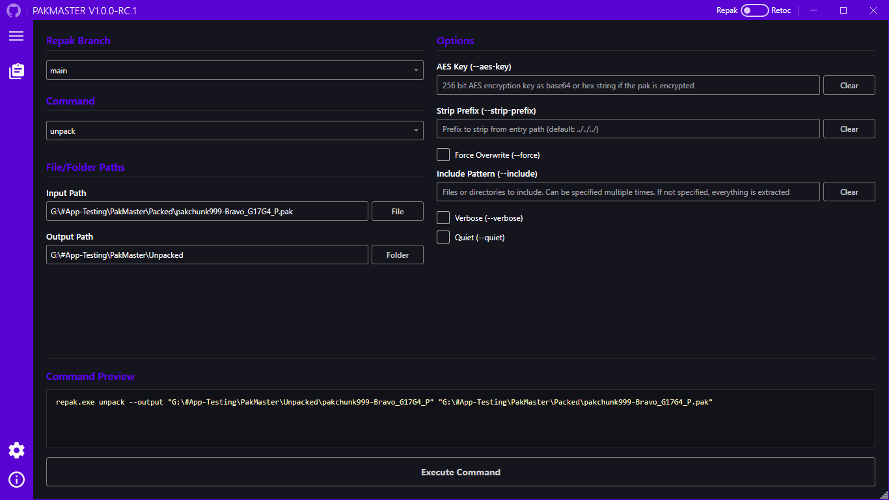
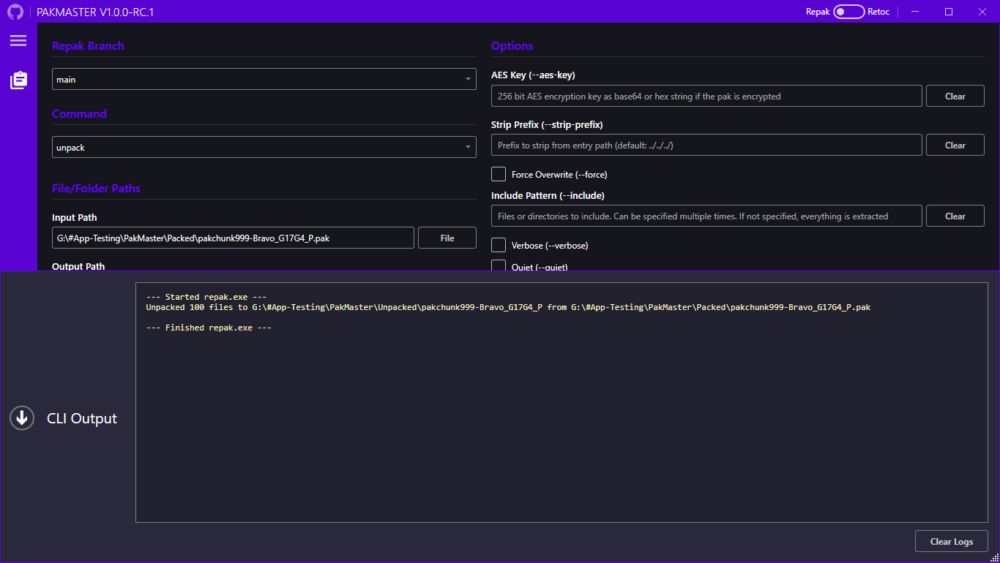
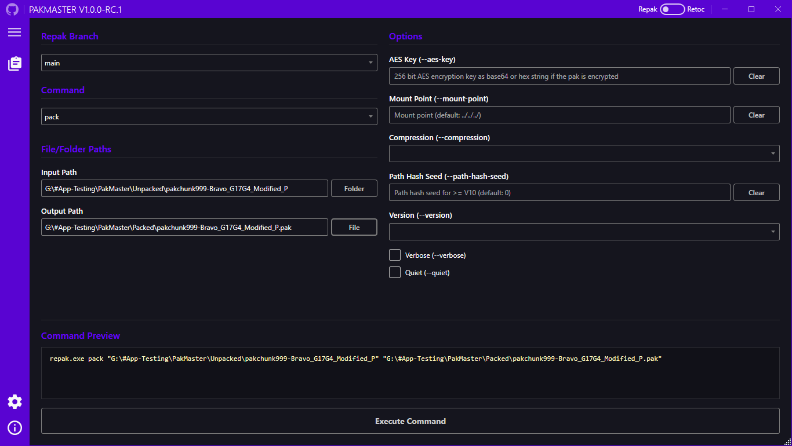
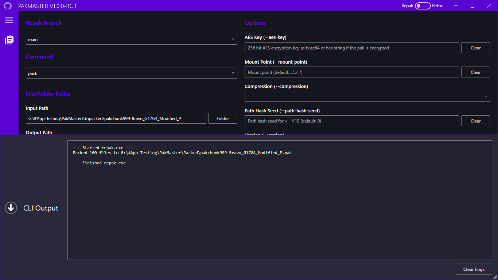
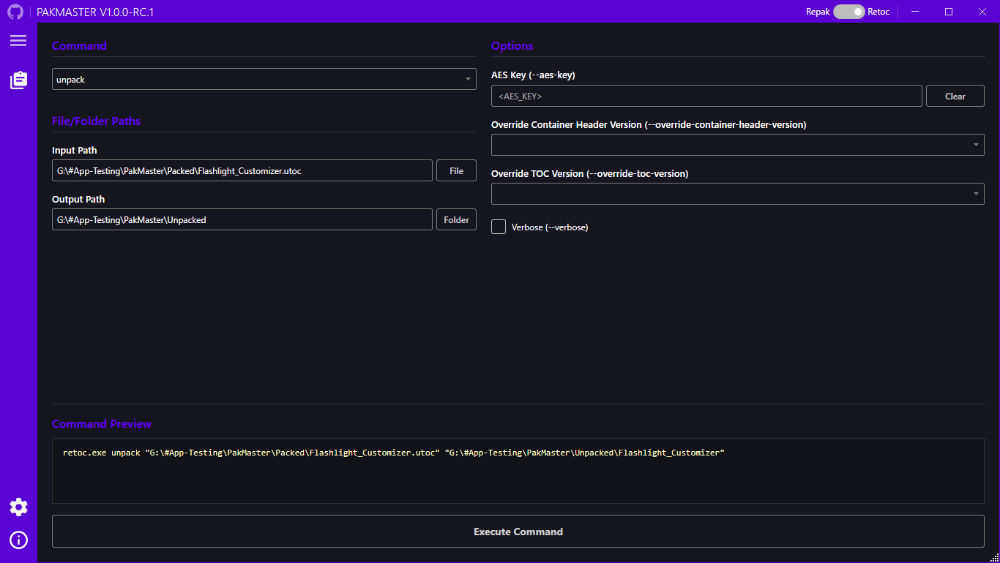
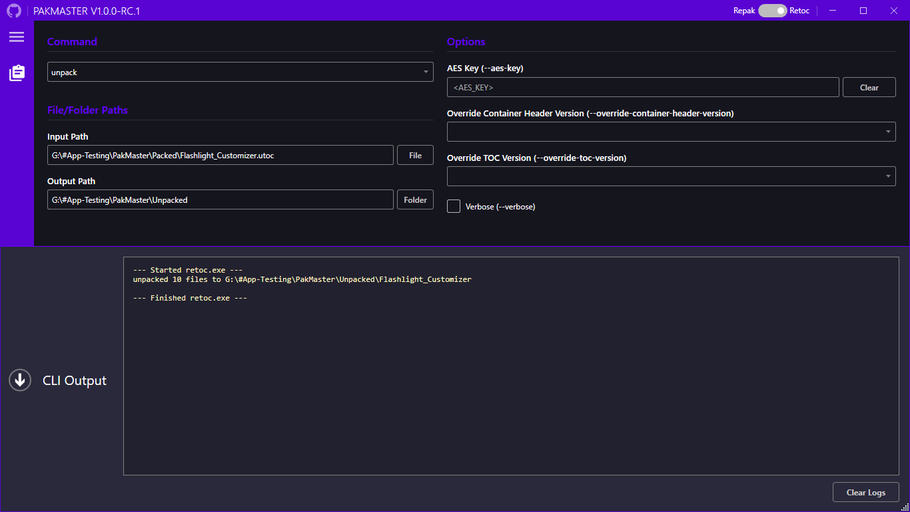
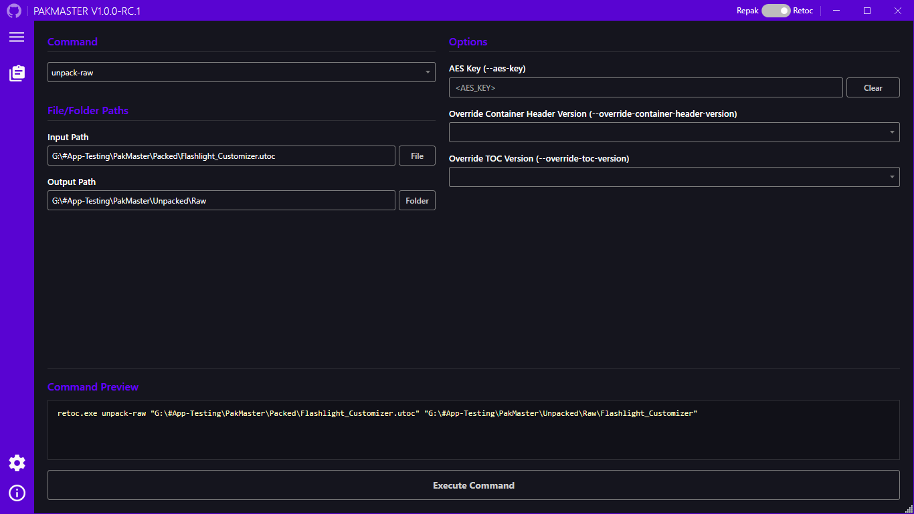
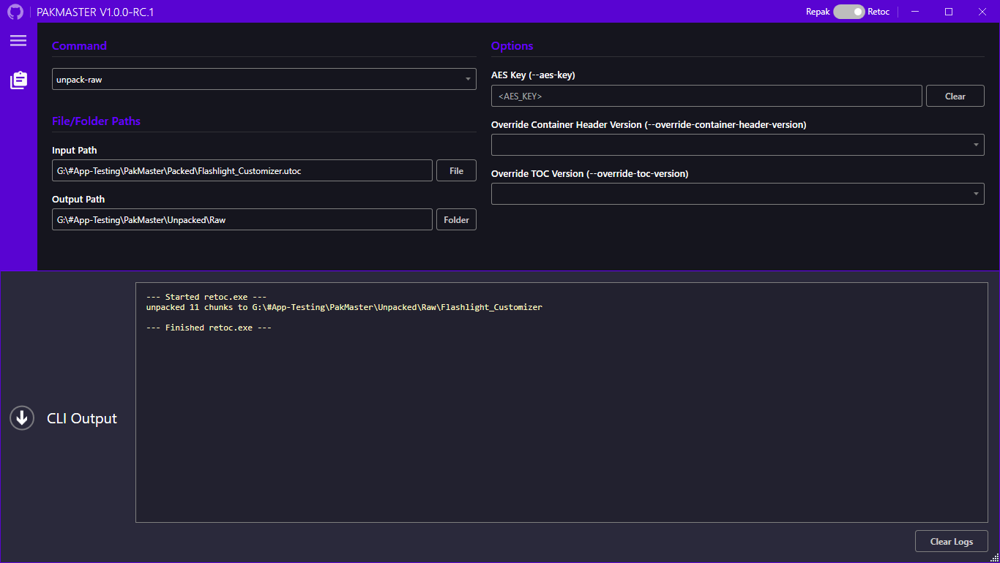
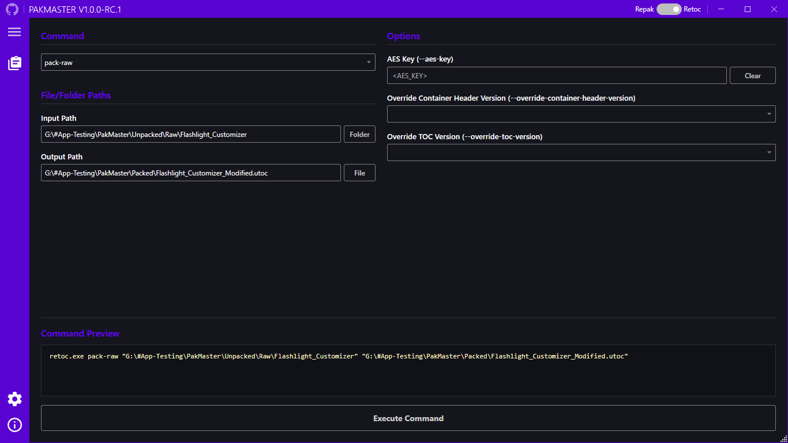
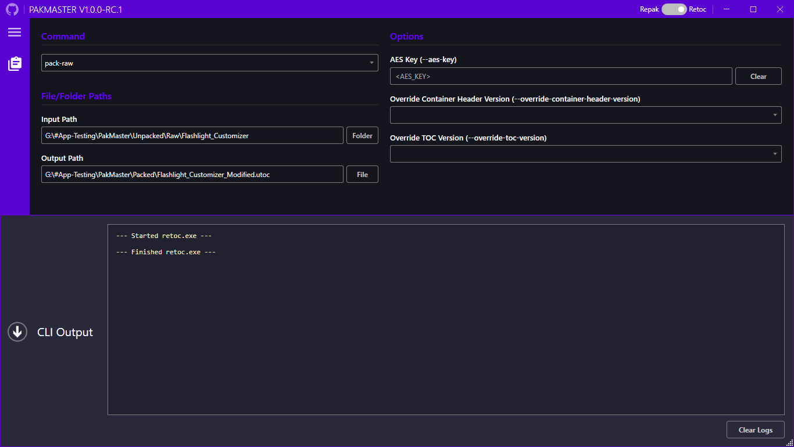

  # PakMaster

  #### A GUI Wrapper for Repak and Retoc

  
  
  
  

   

  
  

   

> [!IMPORTANT]
> PakMaster assumes you have some knowledge about UE5 modding and Unreal Engine. If you are new to Unreal Engine modding, I suggest starting [HERE](https://github.com/Dmgvol/UE_Modding/#ue45-modding-guides).

## Table of Contents

- [How It Works](#how-it-works)
- [Requirements](#requirements)
  - [Software](#software)
  - [OS Support](#os-support)
- [Features](#features)
- [Installation](#installation)
  - [How To Use](#how-to-use)
- [Updating](#updating)
- [Screenshots](#screenshots)
- [Tools Used](#tools-used)
- [Acknowledgements](#acknowledgements)
- [License](#license)

## How It Works

PakMaster simplifies the process of packing and unpacking files by providing a GUI on top of the existing tools [Repak](https://github.com/trumank/repak) and [Retoc](https://github.com/trumank/retoc). 
While these tools handle the core functionality, PakMaster streamlines the user experience, making repetitive tasks quicker and more accessible.

PakMaster does not include Repak or Retoc. 
Instead, it automatically downloads the latest supported versions of Repak and Retoc upon launch.

By using PakMaster, users must also adhere to the licenses of Repak and Retoc in addition to PakMaster's own.

## Requirements

### Software

- [.NET 10.0 Runtime](https://dotnet.microsoft.com/en-us/download/dotnet/10.0)

### OS Support

- [Windows 10/11](https://www.microsoft.com/en-us/windows)
  - Older versions of [Windows](https://windowsbytoll.com/wp-content/uploads/2025/02/file-1-6.jpg) may still work.

## Features

- **Comprehensive Command Builder**
  - PakMaster serves as a fully featured graphical command builder for both **Repak** and **Retoc**. 
  - Rather than being limited to basic pack and unpack operations, the GUI allows you to visually construct and execute *any* command or argument supported by the underlying CLI tools.

- **Persistent Configurations**
  - Never build the same command twice. Every single option you toggle, along with all selected input and output paths, are automatically saved to your configuration.
  - If you close the application, your entire setup will be exactly as you left it the next time you launch.

- **CLI Output Display**
  - Since PakMaster relies on CLI tools under the hood, their live outputs are captured and displayed directly within the GUI. This allows you to monitor progress in real-time and easily troubleshoot issues if they arise.

- **Customizable Interface**
  - Deep QoL features, including language switching, customizable accent colors, and adjustable interface scaling.

- **Repak Branch Switching**
  - Easily toggle between different branches of Repak. 
  - While most games operate perfectly with the standard Repak executable, certain games require specialized builds. PakMaster allows you to easily swap between branch-specific builds (such as ones for Dead by Daylight, Back 4 Blood, etc.)

## Installation

To get started with **PakMaster**, download the [Latest Release](https://github.com/AriesLR/PakMaster/releases/latest).

Once downloaded, you can place the `PakMaster.exe` anywhere on your computer.

### How To Use

It is expected that you are already familiar with how [Repak](https://github.com/trumank/repak) and [Retoc](https://github.com/trumank/retoc) operate. If you know what commands and options you need for Repak and Retoc, using the PakMaster interface to build and execute those commands will feel completely natural.

*(If you are new to these tools, please refer to their respective documentation to understand how they work before using PakMaster).*

## Updating

To update **PakMaster**, download the [Latest Release](https://github.com/AriesLR/PakMaster/releases/latest) and replace your current version of `PakMaster.exe`.

## Screenshots

<table align="center">
  <tr>
    <td align="center">
      <b>Repak Unpack Example</b> 
      
    </td>
    <td align="center">
      <b>Repak Unpack CLI Output Example</b> 
      
    </td>
  </tr>
  <tr>
    <td align="center">
      <b>Repak Pack Example</b> 
      
    </td>
    <td align="center">
      <b>Repak Pack CLI Output Example</b> 
      
    </td>
  </tr>
  <tr>
    <td align="center">
      <b>Retoc Unpack Example</b> 
      
    </td>
    <td align="center">
      <b>Retoc Unpack CLI Output Example</b> 
      
    </td>
  </tr>
  <tr>
    <td align="center">
      <b>Retoc Unpack-Raw Example</b> 
      
    </td>
    <td align="center">
      <b>Retoc Unpack-Raw CLI Output Example</b> 
      
    </td>
  </tr>
  <tr>
    <td align="center">
      <b>Retoc Pack-Raw Example</b> 
      
    </td>
    <td align="center">
      <b>Retoc Pack-Raw CLI Output Example</b> 
      
    </td>
  </tr>
  <tr>
    <td colspan="2" align="center">
      <b>Before / After Comparison</b> 
      
    </td>
  </tr>
</table>

## Tools Used

**Packing/Unpacking (.pak)** - [Repak](https://github.com/trumank/repak)

**Packing/Unpacking (.pak, .utoc, .ucas)** - [Retoc](https://github.com/trumank/retoc)
 
## Acknowledgements

- [Repak](https://github.com/trumank/repak) - Backbone of Pak file operations.

- [Retoc](https://github.com/trumank/retoc) - CLI responsible for handling IoStore Container operations.

- [Buckminsterfullerene02](https://github.com/Buckminsterfullerene02/) - For the [UE Modding Tools](https://github.com/Buckminsterfullerene02/UE-Modding-Tools/) databank and contributing to the [UE Modding Guide](https://github.com/Dmgvol/UE_Modding#ue45-modding-guides).
  - [elbadcode](https://github.com/elbadcode) - For contributing to the UE Modding Tools databank.
  - [spuds](https://github.com/bananaturtlesandwich) - For contributing to the UE Modding Tools databank.

- [Dmgvol](https://github.com/Dmgvol/) - For the [UE Modding Guide](https://github.com/Dmgvol/UE_Modding#ue45-modding-guides).

- [Narknon](https://github.com/narknon) - For helping me understand how UE Modding works regarding IoStore Containers.
  - Link may be wrong, our conversations took place on discord, but I think this is their GitHub.

- [1Armageddon1](https://github.com/1armageddon1) - For being the OG tester for the tool as well as helping give insight on how the tool should work. Wouldn't be nearly as far as I am progress-wise without them.

## License

[MIT License](LICENSE)

## Issues
If any issues do happen, PLEASE report them here first. It is very likely an issue on my part and if it is not I'll relay the information to the authors of the responsible dependency. Don't bother other authors about PakMaster as I am entirely responsible for it. If you are 100% sure that it's an issue with Retoc or Repak then you can create an issue on their repos, but if you are not sure about it always report it to me.

